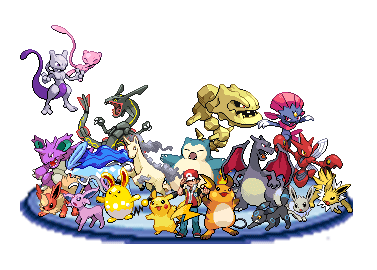
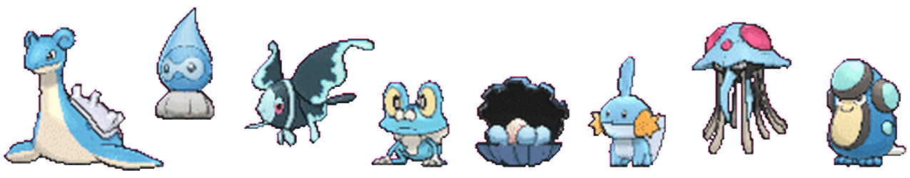

<justify>


## **Atividade Semanal 8  - Turma On16** 📚 💻 
___


## ⚡ HTTP
*Hypertext Transfer Protocol (HTTP)*

O protocolo HTTP é o meio de comunicação entre Cliente e Servidor, é com ele que enviamos requisições. 


### ⚡ HTTP: Requisição e resposta

#### Principais verbos HTTP

Os verbos HTTP são os métodos usados para que a interação Cliente x Servidor aconteça. 

*GET* - Busca informações
*POST* - Cria novas informações
*DELETE* - deleta informações
*PUT* - modifica integralmente uma informação
*PATCH* - modifica parte de uma informação

####Códigos de status de respostas HTTP

São as repostas padrão para descrever o estado de uma requisição realizada através do HTTP.
Resumidamente se classificam:

Respostas de informação (100-199),
Respostas de sucesso (200-299),
Redirecionamentos (300-399)
Erros do cliente (400-499)
Erros do servidor (500-599).

### ⚡ Criando rotas utilizando o Express

Ao criamos as rotas, conseguimos configurar a porta, o endoint, qual o tipo de requisição queremos fazer: get e qual o retorno esperado. 
Utilizando o Express, temos a seguinte sintaxe básica para a criação de uma rota:

```
const express = require('express');
const app = express();

app.get('/', function(req, res) {
  res.send('Esta é minha mensagem para o primeiro endpoint');
});

```


### **⚡ API**

 ***A**pplication **P**rogramming **I**nterface* - Interface de Programação de Aplicativos

É um conjunto de definições e protocolos para criar e integrar softwares, com elas conseguimos usar funcionalidades já prontas e aplicá-las em outra arquitetura. Ex.: API dos Correios para consulta de CEP, API da PagSeguro para que o cliente consiga realiza pagamento em vários sites, API do Google Maps...


___


### ⚡ Exercício para entrega - Atividade Semanal 8

##### Linguagens, tecnologias, libs e dependências: 
- JavaScript
- Node.Js
- Express
- Postman

Foi utilizado um mockup Json com personagens pokemons e, inicialmente, realizada a criação de cinco rotas utilizando os métodos GET e POST com teste via Postman. 


| Rotas | O que é esperado | O que é esperado|
| :------: | :-----------: | :-----------: |
| app.get('/pokemons'   | Rota com todos os Pokemons |  
| app.get('pokemons/buscar/:id'| Rota para buscar Pokemon por ID |   | 
| app.get('pokemons/filtro-nome' | Rota para buscar Pokemon por Nome  | 
| app.get('pokemons/filtro-tipo' | Rota para buscar Pokemon por Tipo |  |
|app.post('/pokemons/'| Rota para criar um Pokemon |  |

___


##### Essa atividade faz parte do cronograma da semana 8 da Turma On 16 do bootcamp Todas em Tech {Reprograma}


